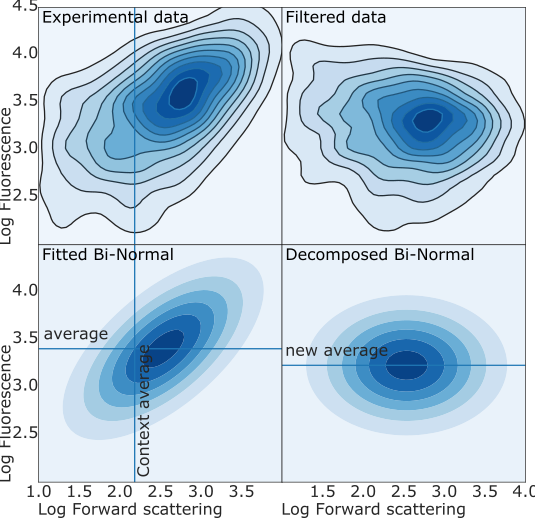

# FlowScatt
This tool transform an ensamble of flow cytometry data experiment in a scattering dependent and non-dependent part.

It has the following functionalities,

    It fits your individual experiments to a bivariate log-noraml distriburion, giving:

        the mean and standard diviations of fluorescence
        the mean and standard diviations of FCS (or SSC)
        the correlation between the measures
        An R-squered value for the goodnes off fit.

    It takes the ensamble avarage of the mean FCS (or SSC)
    It calculates the rescaled fluorescence points at the ensamble average
    It provides a mean rescaled fluorescence

This is described in our paper at :....

The current version of the tool only supports the Flow Cytometry Standard files(.fcs)

As an example the tool will defaultly download the example data from:
https://data.ncl.ac.uk/articles/dataset/Reconfigurable_genetic_inverters_using_contextual_dependencies/12073479
As described in our paper: .....
Note that this will take up ca. 20GB  of disk space on your machine.

To run the example:

`python3 preprocessing.py --download --min-to-back`

The resulting database is a comma seperated file called "standardised.csv" it contains:

    filename, name of flow cytometry file
    date, date of measurment
    strain, an identifier for the used strain

    log_mean_gfp, the fitted log-mean of the gfp_H channel
    log_mean_v, the fitted log-mean of the forward scatter_H channel
    log_std_gfp, standard deviation fitted gfp_H
    log_std_v, standard deviation fitted FSC_H
    log_rho, the fitted correlation between the two channels
    fit_goodness, the R squared value form fit
    std_gfp_correct, the reduced std when conditioned on volume
    volume_decomposed_log_mean_gfp, the mean gfp of distribution at scatter average for context

optional extras but required for the example by huseyin et al.

    plasmid, all plasmid information
    backbone, backbone of the used plasmid
    iptg, the concentation of iptg used for induction.
    rrpu, the standard rpu units with volume_decomposed_log_mean_gfp instead of normal gfp

To use the tool with your own data:

-Put your files in a Directory /FCS folder in the same direcory as this tool.
-Put a data file description "file_description.csv" in the same directory like shown in the example.
-run decompose_volume.py

This results in a file called "volume_decomposed.csv"
